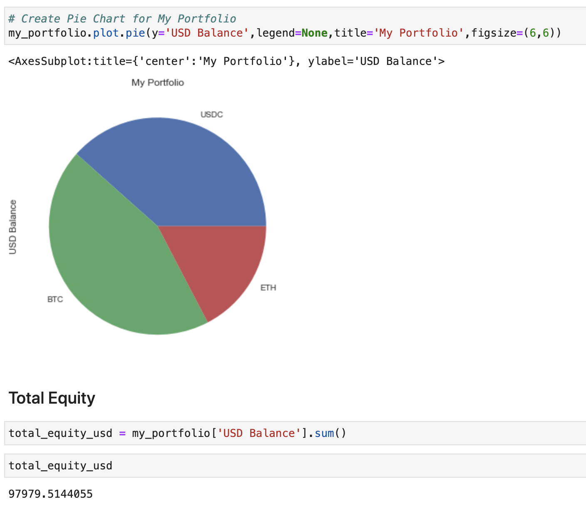

# Simple and Useful Crypto Dashboard
### Track multiple wallets through Coinbase and Zapper API as well as use further resources to make educated investment decisions all in one place.
---
#### By: Rafael Sy, Emmanuel Constant, Ludovic Schneider, Lucas Shaiman, Juan Izquierdo Teran, and Patty Y
---

# Installs and Dependencies

> [Python](https://docs.python.org/)

> [Zapper API](https://docs.zapper.fi/)

> [Coinbase API](https://developers.coinbase.com/api/v2)

> [Yahoo Finance API](https://pypi.org/project/yfinance/)

> [CoinGecko API](https://www.coingecko.com/en/api)

> [Dash / Plotly](https://dash.plotly.com/)

> [SciPi](https://www.scipy.org/)

> [Pandas](https://pandas.pydata.org/docs/)

> [Matplotlib](https://matplotlib.org/contents.html)

> [Panel](https://panel.holoviz.org/)

*You will need to generate an API key for Coinbase and plug in your address into Zapper's API*

---

# Quick Overview

## The dashboard will consist of few key components: 
- Heatmap: Showcasing how much BTC is "boiling over" or "cooling down" shown by the different colors. 
- Dollar Cost Averaging Tool: Visualizing what stage the asset is in to determine whether you should be buying v. selling and what percentage. 
- Main Holdings: Showcasing all of your holdings in one place, all assets from Coinbase, Metamask, and the DeFi space using Zapper. 
- Trade History: Showcasing all past trades and past performance so you can track your progress and make adjustments where you see fit.

---

# How to use: A further deep dive into key sections

# Heatmap

### This heatmap was reverse engineered and pulled from [Benjamin Cowen](https://www.youtube.com/watch?v=6CiFVI24CXM) and showcases when BTC is beginning to reach all time highs or about to correct. It does a great job at displaying when BTC is a buy vs sell. 

---

# Dollar Cost Averaging Tool

### By using a [dollar cost average trading strategy](https://www.investopedia.com/terms/d/dollarcostaveraging.asp#:~:text=Dollar%2Dcost%20averaging%20(DCA)%20is%20an%20investment%20strategy%20in,price%20and%20at%20regular%20intervals.) we'd like to use this graph when deciding whether to buy or sell depending on where BTC is in the market. 

- ### As the price of BTC enters a new threshold represented by the color changes that will show you what you should look to do next

- ### Example: as the price enters a red zone that is a signal to the user to begin selling off, weekly.

- ### Vice Versa: as the price transitions to the blue threshold, begin buying, weekly increasing your percentage over time. 

---

# Main Holdings (coming soon)

### Using Coinbase's API were able to extract and convert a users wallet into a dataframe that showcased all of their trade and asset information. 

### After trial and error using both the API and trying to pull this data into a Panel and Ploty dashboard we were unable to generate the proper functions to pull in the data how we wanted. With further refinement however, we intend to get this up and running with "plug and play" compatibility along with Zapper's API to integrate DeFi and NFT assets. 

---

# Trade History (coming soon)

### By pulling more information using Coinbase and Zapper's APIs we'd like to generate a timeline of transactions to give users a history of their performance. 

### This will be a quick and easy way to track progress and determine what investments are working and which may need a closer analysis. 

--- 

# Sources

[Dollar Cost Averaging Strategy](https://www.investopedia.com/terms/d/dollarcostaveraging.asp#:~:text=Dollar%2Dcost%20averaging%20(DCA)%20is%20an%20investment%20strategy%20in,price%20and%20at%20regular%20intervals.)

[Benjamin Cowen - Heatmap](https://www.youtube.com/watch?v=6CiFVI24CXM)

[F Neves - Simple Portfolio Tracker](https://www.youtube.com/watch?v=wYvx8K-nzg4)

[Yearn Finance](yearn.finance)

